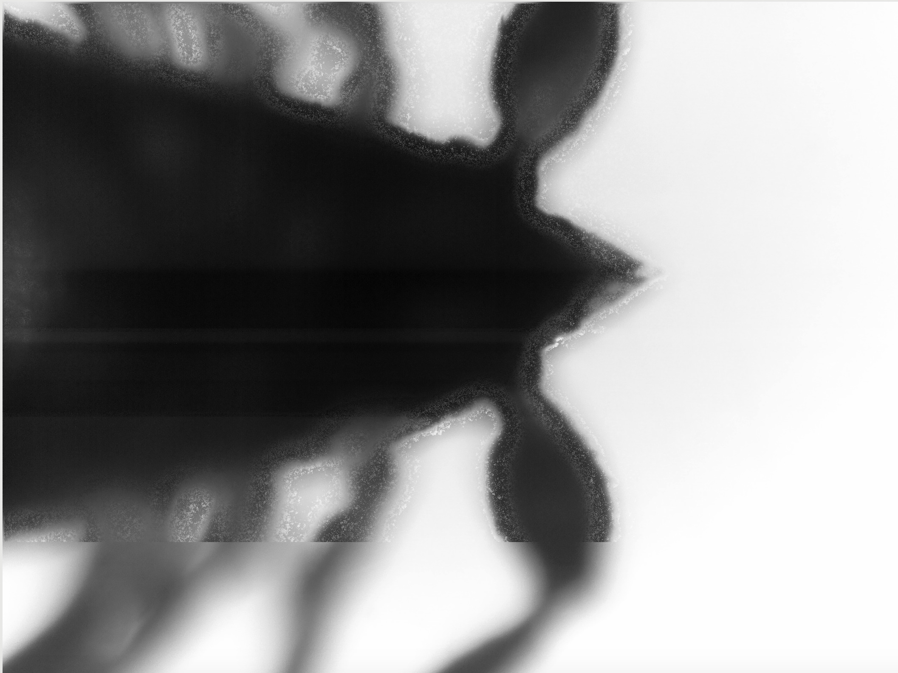
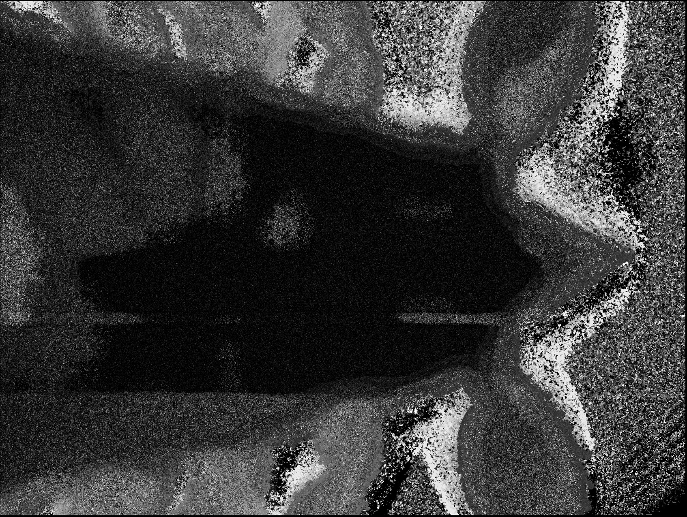

# Focus Stack

This is an experiment in focus staking

It started by me not knowing very much about the subject, except that
it exists.  I do have a microscope though, and it has a nice camera (a
raspberry pi camera in a 3D printed adapter) mounted on it, so it can
take tme series of pictures.  If I move the focal plane up and down I
will get pictures that are sharp in some parts and blurred in others.
The idea of focus stacking is to pick out the parts that are sharpest
from all of the pictures in the series and combine them into a picture
that is sharper than any of the original pictures.

Eventually wrote some code in Julia.   Found a blurriness estimator in
[1] and implemented that (I think, just read the paper and implemented
it as best as I could without testing that all my assumptions are correct).

Have tested the algorithm on test images from Julia's image processing
library, and on a set of microscopic pictures in a series called
"scorpion-lapse", which is a series of pictures of a "house
pseudoscorpion" (Chelifer Cancroides) that I captured in my home :)

All of the software here will be open sourced using the Apache 2
license. The image series is Apache 2 licensed (by me, I took the
pictures).

# The basic idea (as far as I can tell)
  +  Start with a list of images.
  +  For each pixel in each image, determine a "sharpness" value.  This
     value is a proxy for the number of high frequency features available
     in close (a few pixels) proximity of that pixel.  Higher values
     means more high frequency elements.
  +  To generate a sharp image, for each pixel in the resulting image,
     pick the pixel from the image that has the sharpest value for that
     particular pixel

# How I got there.

Tried octave, too hard. Tried julia, wouldn't load my images.  Waited two years, downloaded https://juliacomputing.com/ juliapro 0.6, and that just worked right out of the box.   Googled "blurriness estimation" (+ variations and permutations), found [1], implemented it.  Fiddled around to get some pictures through the pipeline  to verify that it actually does something reasonable, and now it does.

# Where it is today

Some stacking is happening :-)   

So, some things to note about this picture:

* It's not that sharp, this is probably because it's based on only 12 input pictures, none of which are very sharp :-)
* It is in fact _Much_ sharper than any of the input pictures
* There are small "bubble"-like artefacts that happens when the selector algorithm for some reason selects a pixel from another plane right inside a region where that doesn't make much sense.
* There is a bug that stops the selection algorighm from being applied to the bottom 1/5 or so of the picture

All of these item represents bugs that should/could be addressed.

However, there is another interesting feature from the processing.  The selection map, i.e. the map showing which image is the sharpest, is interesting in itself.   It represents a kind of "depth map", that could easily be interpreted as a 3D surface model of the object being studied.    So, given small enough slices/focus planes, the microscope could easily be used as a 3D scanner for microscopic object.  Cool!

# Some possible future directions

* Better runtime efficiency.   Less copying, and also perhaps use some FFT hacks to avoid running on FFT of a neigbourhood per pixel.

* Use the blurriness map to make a 3D density map of the object being imaged (a combination of thresholding and "Marching Cubes" I presume.

* Make a 3D model of the object that can be displayed in a browser with OpenGL and/or be printed by a 3D printer.

# Current TODO

* Introduce proper unit tests, using an unit test library of some sort.
* Introduce a set of performance tests that will time tests (unit or
  otherwise), log the results in an appropriate manner (e.g. json
  files) and plot the time evolution of timings.

* Look at the blurriness maps.  There are some bugs there, they should
be removed (centering of blocks).
* Rewrite processing code to  store intermediate values on file
when processing a batch (e.g. blurriness matrixes), and
read from file rather than compute if values are available there.
This is a good idea since it now takes a very long time to
run through a dataset even when a minor change is done, since a large
amount of calculations needs to be done again, since they are stores
inside the runtime environment and nowhere else.
* Look at the distribution of blurrinesses in  an image.   Apply some
  statistics techniques.

* Make a much quicker blurriness estimator. Currently we're working on
  a 5x5 estimator that uses FFTs and whatnot to estimate blurriness.
  Question: Can that highly nonlinear implementation be approximated
  by a convolution over the original image.  Because i it can, then we
  can use the "fft hack" F^{-1}(F(g)+F(h)) wher g is the original
  image, h is the convolution kernel, F is the FFT operator, and
  F^{-1} is the inverse FFT operator. Since this operation has O(n*log(n))
  an FFTs are pretty optimised, this could be very quick.  It's a fun
  experiment to do.

* Think about making a smaller subset of the scorpion stack that
   can be used for development work (e.g. a 50x50   slice through the
   stack.
*  Read files in a more efficient manner (less
   conversions/duplications).
*  See if the process can more clearly be described as a map/reduce
process.
* Think about setting up an automatically generated experiment to
  compare various algorithm parameters.

## More references on how to do focus stacking

+ https://en.wikipedia.org/wiki/Focus_stacking
+ GPL software
  + https://en.wikipedia.org/wiki/CombineZ
  + https://en.wikipedia.org/wiki/Hugin_(software)
  + http://sourceforge.net/projects/macrofusion/
  + http://rsb.info.nih.gov/ij/plugins/stack-focuser.html

[1] "Image Sharpness Measure for Blurred Images in Frequency" by
      Kanjar De and V. Masilamani.   Procedia Engineering 64 ( 2013 ) 149 – 158
     International Conference on DESIGN AND MANUFACTURING, IConDM 2013
